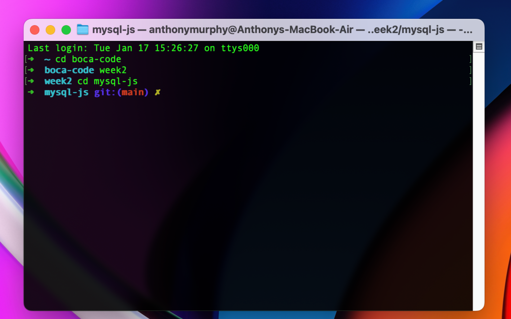

# MySQL with JavaScript
week 2 , day 2. connecting MySQL with JavaScript using Node.
<!-- You can't see this line in the preview. -->

## Lesson Learned
1. Node
2. NPM
3. MySQL
4. Secrets

## See the demo [click here](https://www.bocacode.com).

